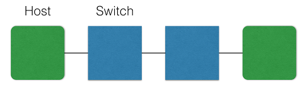
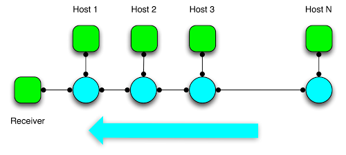

gt-cs6250
=========

Project code for CS6250 (Computer Networking) at Georgia Tech for fall 2014, lectures freely available through Udacity. Work done using [Mininet](https://github.com/mininet/mininet/wiki/Introduction-to-Mininet) to simulate network environments.

Nam Pho (npho3@gatech.edu) <br />
Forked 9/4/14


##Table of Contents
- [Notes](#notes)
- [assignment-2](#assignment-2)
- [assignment-3](#assignment-3)
- [assignment-4](#assignment-4)
- [assignment-5](#assignment-5)


####Notes
1\. Clone the original OMS6250 repo and fork it.

```
$ git clone https://github.com/OMS6250/gt-cs6250.git
```

2\. Adjust the repo to point to your fork and then upstream as the original.

```
$ git remote set-url origin git@github.com:nampho2/gt-cs6250.git
$ git remote add upstream https://github.com/OMS6250/gt-cs6250.git
```

3\. Keep fork in sync with original from Github [docs](https://help.github.com/articles/syncing-a-fork).

```
$ git fetch upstream
$ git checkout master
$ git merge upstream/master
```

4\. Adjust `PYTHONPATH` environment variable to include helpful cross-assignment imports.

```
export PYTHONPATH=`pwd`/lib/:$PYTHONPATH
```

or

```
export PYTHONPATH=/home/mininet/gt-cs6250/lib/:$PYTHONPATH
```


####assignment-2



- Run `topology.sh` and review output.
- Modify `mntopo.py` to insert an additional switch between the hosts. Helpful to review Mininet [documentation](https://github.com/mininet/mininet/wiki/Introduction-to-Mininet#wiki-creating) on this.
- Rerun `topology.sh`, output should be similar.
- Test latency by running the ping wrapper, `ping.py`. Should get ~6ms.
- Increase the latency delay from 1ms to 10ms in `mntopo.py`.
- Re-test latency. Should get ~60ms.
- Increase the bandwidth from 10Mbps to 50Mbps in `mntopo.py`.
- Re-run `topology.sh` and review output.


####assignment-3



- Complete the `__init__` function of the `ParkingLotTopo` class to generalize this for any number of hosts, n > 0. The resulting topology is as shown in the figure above.
- Complete the `run_parkinglot_expt` function to generate TCP flows using `iperf`. 
- Final result is running `sudo ./parkinglot-sweep.sh` to test various parameters of `n = 1, 2, 3, 4, 5`.
- Run my additional `submit.sh` script to collect the output of `parkinglot-sweep.sh` wrapper per submission specifications. Submit all `bwm.txt` files.
- Complete additional quiz questions in `quiz.txt`.


####assignment-4

- In progress.


####assignment-5

- Work next week.


