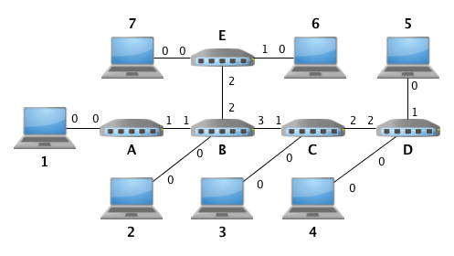
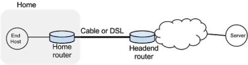
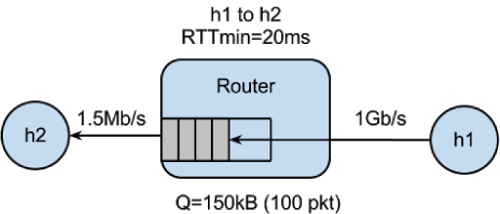

CS6250
======

Project code for CS6250 (Computer Networking) at Georgia Tech for fall 2014, lectures freely available through Udacity. Work done using [Mininet](https://github.com/mininet/mininet/wiki/Introduction-to-Mininet) to simulate network environments.

Nam Pho (npho3@gatech.edu) <br />
Forked from https://github.com/OMS6250/gt-cs6250 on 9/4/14


##Table of Contents
- [Notes](#notes)
- [assignment-2](#assignment-2-mininet-topology) Mininet Topology
- [assignment-3](#assignment-3-parking-lot) Parking Lot
- [assignment-4](#assignment-4-learning-switch) Learning Switch
- [assignment-5](#assignment-5-buffer-bloat) Buffer Bloat
- [assignment-6](#assignment-6-tcp-fast-open) TCP Fast Open
- [assignment-7](#assignment-7-tba) TBA
- [assignment-8](#assignment-8-tba) TBA
- [assignment-9](#assignment-9-tba) TBA


####Notes
1\. Clone the original OMS6250 repo and fork it.

```
$ git clone https://github.com/OMS6250/gt-cs6250.git
```

2\. Adjust the repo to point to your fork and then upstream as the original.

```
$ git remote set-url origin git@github.com:nampho2/CS6250.git
$ git remote add upstream https://github.com/OMS6250/gt-cs6250.git
```

3\. Keep fork in sync with original from Github [docs](https://help.github.com/articles/syncing-a-fork).

```
$ git fetch upstream
$ git checkout master
$ git merge upstream/master
```

4\. Adjust `PYTHONPATH` environment variable to include helpful cross-assignment imports.

```
export PYTHONPATH=`pwd`/lib/:$PYTHONPATH
```

or

```
export PYTHONPATH=/home/mininet/gt-cs6250/lib/:$PYTHONPATH
```


####assignment-2: Mininet Topology


- Run `topology.sh` and review output.
- Modify `mntopo.py` to insert an additional switch between the hosts. Helpful to review Mininet [documentation](https://github.com/mininet/mininet/wiki/Introduction-to-Mininet#wiki-creating) on this.
- Rerun `topology.sh`, output should be similar.
- Test latency by running the ping wrapper, `ping.py`. Should get ~6ms.
- Increase the latency delay from 1ms to 10ms in `mntopo.py`.
- Re-test latency. Should get ~60ms.
- Increase the bandwidth from 10Mbps to 50Mbps in `mntopo.py`.
- Re-run `topology.sh` and review output.


####assignment-3: Parking Lot


- Complete the `__init__` function of the `ParkingLotTopo` class to generalize this for any number of hosts, n > 0. The resulting topology is as shown in the figure above.
- Complete the `run_parkinglot_expt` function to generate TCP flows using `iperf`. 
- Final result is running `sudo ./parkinglot-sweep.sh` to test various parameters of `n = 1, 2, 3, 4, 5`.
- Run my additional `submit.sh` script to collect the output of `parkinglot-sweep.sh` wrapper per submission specifications. Submit all `bwm.txt` files.
- Complete additional quiz questions in `quiz.txt`.


####assignment-4: Learning Switch



- Code `learn_route()` function in `learning-switch.py` code to generate ARP tables.
- Run topology with commands:

```
# symbolically link topology to pyretic
$ ln -s ~/CS6250/assignment-4/learning-switch.py ~/pyretic/pyretic/modules/

# run pyretic first
$ cd ~/pyretic/
$ python pyretic.py -m p0 pyretic.modules.learning-switch

# run mininet in separate terminal
$ cd ~/CS6250/assignment-4/
$ sudo python learning-switch-topo.py

# pingall hosts
mininet> pingall
```

- Answer some quiz questions in `hw4.txt`.
- Note: use `arping` to send single ARP packets and watch the learning switch in action to answer quiz.

```
# install arping in Ubuntu
$ sudo apt-get install arping

# 0. h2 ping (ICMP) h6
mininet> h2 ping h6

# 3. h2 ARP request to h6
mininet> h2 arping -B -c 1 h6

# 4. h6 ARP reply to h2
mininet> h6 arping -b -c 1 -t 00:00:00:00:00:02 h2

# 5. h6 ARP request to h3
mininet> h6 arping -B -c 1 h3

# 6. h3 ARP reply to h6
mininet> h3 arping -b -c 1 -t 00:00:00:00:00:06 h6
```


####assignment-5: Buffer Bloat

Simulate buffer bloat as seen on typical home ISP connection as seen in the figure below:



The corresponding abstract Mininet topology is represented below:



asdf


####assignment-6: TCP Fast Open

- Work next week.


####assignment-7: TBA

- Work next week.


####assignment-8: TBA

- Work next week.


####assignment-9: TBA

- Work next week.


